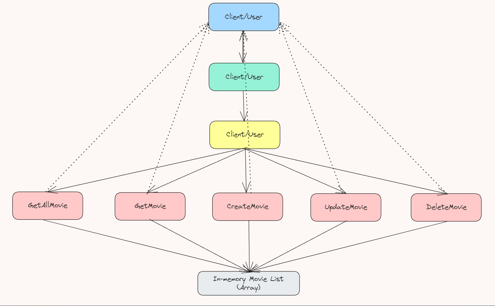

# Movie Management REST API in Go

This is a simple Movie Management API built using Go and Gorilla Mux. The API allows users to perform basic CRUD operations (Create, Read, Update, Delete) on movies. The movie data is stored in an in-memory array and includes fields such as movie ID, ISBN, title, and director details.

## Features

- **GET** `/movies` - Retrieve all movies
- **GET** `/movies/{id}` - Retrieve a specific movie by ID
- **POST** `/movies` - Create a new movie
- **PUT** `/movies/{id}` - Update a movie by ID
- **DELETE** `/movies/{id}` - Delete a movie by ID

## Block Diagram

Below is the block diagram representing the flow of the API:



### Explanation of Components:

1. **User/Client**: Sends HTTP requests to interact with the movie database. This can be done using tools like Postman, curl, or a web browser.
  
2. **HTTP Server (port 8000)**: Listens for incoming HTTP requests and forwards them to the router for processing.

3. **Router (Gorilla Mux)**: Handles incoming HTTP requests and maps them to the appropriate handler functions based on the request method (GET, POST, PUT, DELETE).

4. **Handler Functions**:
   - `getMovies`: Returns all movies.
   - `getMovie`: Returns a specific movie by its ID.
   - `createMovie`: Adds a new movie to the database.
   - `updateMovie`: Updates the details of an existing movie by its ID.
   - `deleteMovie`: Deletes a movie by its ID.

5. **In-memory Movie List (Array)**: A temporary storage system (an array of movies) that stores the movie data. Operations are performed on this list.

6. **Response (JSON)**: After processing, the API returns a JSON response to the client with the relevant data or operation result.

## How to Run

1. Clone the repository:

   ```bash
   git clone <your-repo-url>
